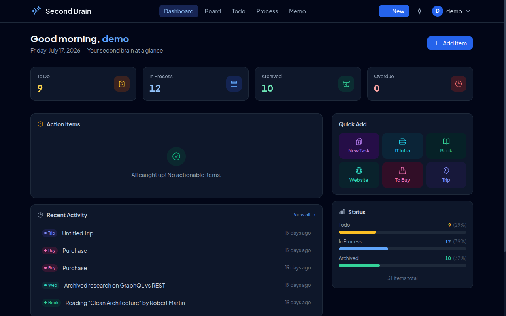
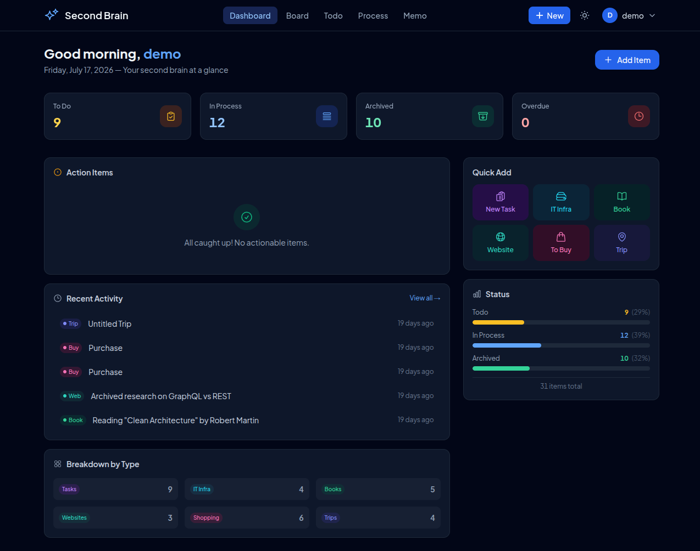
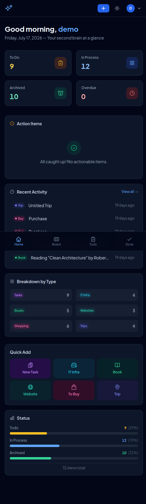
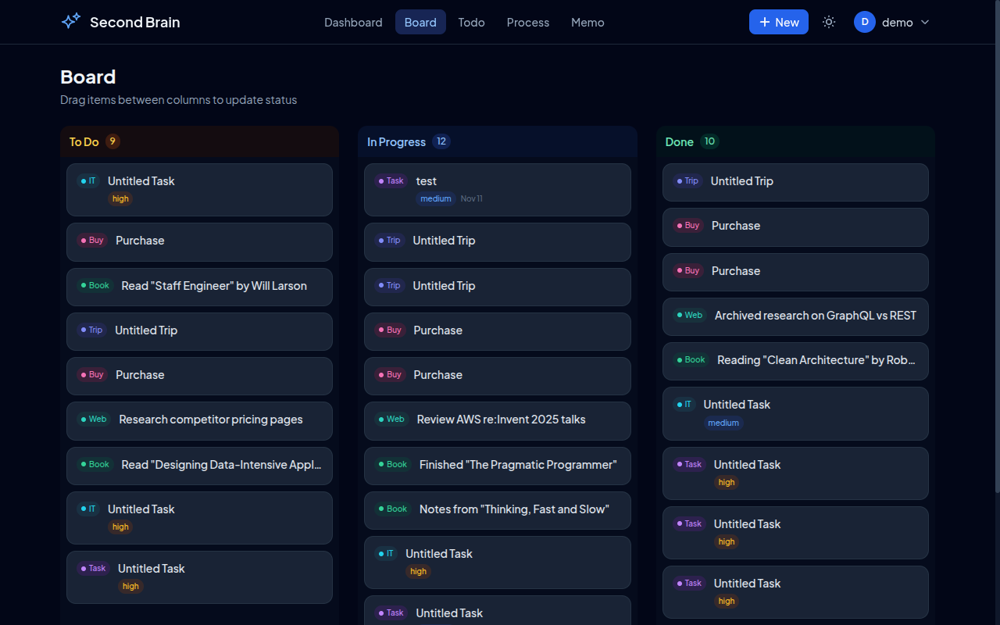
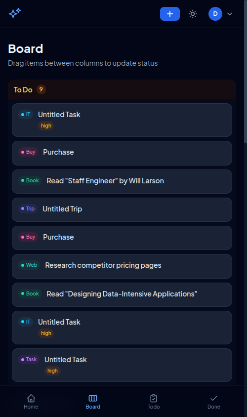
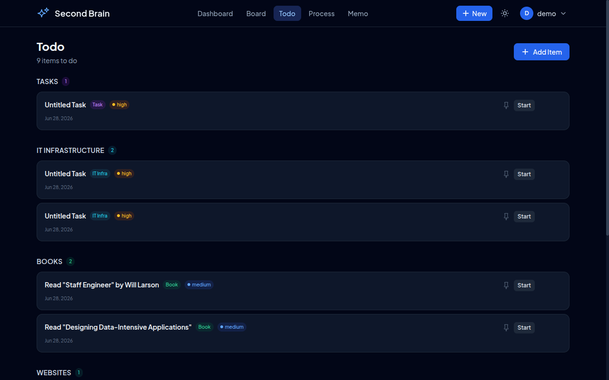
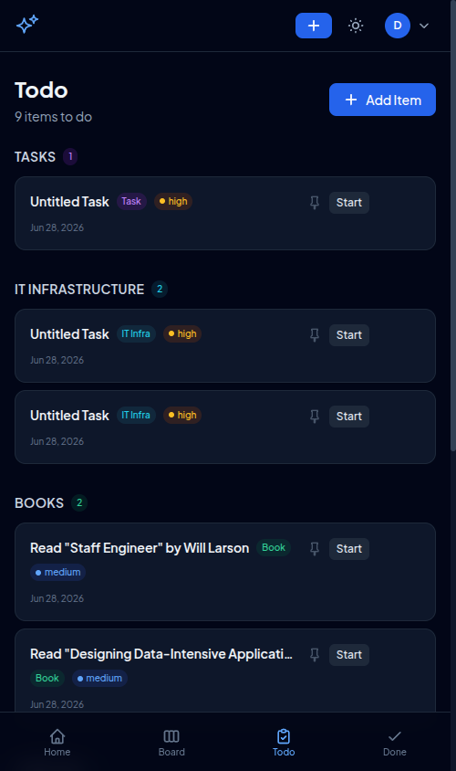

# Second Brain

A personal knowledge management app built around the **Capture → Process → Memo** lifecycle. Track tasks, reading lists, purchases, and travel plans — then refine them into lasting notes.

**Live:** [second-brain-claude.vercel.app](https://second-brain-claude.vercel.app/login)

## Features

- **Task Management** — Create, organize, and track tasks with status, priority, and due dates
- **Kanban Board** — Drag-and-drop boards for visual status management (`@dnd-kit`)
- **Reading Tracker** — Log books and websites with progress tracking and notes
- **Shopping List** — Track purchases with budgets, links, and status
- **Trip Planner** — Plan trips with dates, destinations, and itineraries
- **IT Infrastructure Tracker** — Dedicated fields for infrastructure tasks (`task-it-infra`)
- **Dashboard** — Actionable overview with overdue, due-today, and upcoming items
- **Search** — Full-text search across all items
- **Analytics** — GoatCounter self-hosted analytics with SRI integrity
- **Dark Mode** — Built-in theme toggle

## Screenshots

### Login



### Dashboard





### Kanban Board





### Todo List





## Tech Stack

| Layer | Stack |
|-------|-------|
| Frontend | React 18, TypeScript, Vite 5, Tailwind CSS 3, Zustand, react-router-dom v6 |
| Backend | Node.js, Express 4, TypeScript |
| Database | SQLite (local via `@libsql/client`), Turso (production) |
| Auth | JWT (`jsonwebtoken`) + `scrypt` password hashing |
| Deploy | Vercel (serverless API + static frontend) |

## Getting Started

### Prerequisites

- Node.js 18+
- npm

### Install & Run

```bash
# Clone the repo
git clone https://github.com/kpc/second-brain-claude.git
cd second-brain-claude

# Install dependencies
cd frontend && npm install
cd ../backend && npm install

# Seed the database (optional — creates sample data)
cd backend && npm run seed

# Start both servers
cd frontend && npm run dev   # Vite dev server on :5173
cd backend && npm run dev    # Express dev server on :3001
```

The frontend proxies `/api` requests to `localhost:3001` automatically via Vite config.

## Project Structure

```
second-brain-claude/
├── frontend/                 # React SPA (Vite)
│   └── src/
│       ├── pages/            # Dashboard, Login, ItemForm, Memo, Process, Todo, Kanban
│       ├── components/       # auth/, dashboard/, items/, layout/, search/, tables/, ui/
│       ├── api/              # API client and mock data
│       ├── store/            # Zustand stores (auth, items)
│       ├── hooks/            # useAuth, useItems, useTheme
│       └── types/            # TypeScript types
├── backend/                  # Express dev server
│   └── src/
│       ├── routes/           # auth, items, categories, itInfra, search, stats
│       ├── models/           # item, category, search, user
│       ├── middleware/        # auth, errorHandler, validate
│       └── utils/            # crypto, itemFields, jwt
├── api/
│   └── index.ts             # Production serverless entry point (Vercel)
├── Deployment/              # Deployment configs (Vercel+Turso, Docker, PM2+Nginx)
└── .claude/                 # Claude Code agents and skills
```

## Item Types & Lifecycle

Six item types, each with specialized fields:

| Type | Description |
|------|-------------|
| `task` | General tasks with priority, due date, status |
| `task-it-infra` | IT infrastructure tasks (servers, networks, etc.) |
| `reading-book` | Book tracking with author, pages, progress |
| `reading-website` | Website articles with URL, read status |
| `buying` | Purchases with budget, links, buy status |
| `trip` | Travel plans with dates, destinations, itineraries |

Items move through three stages: **Todo → Process → Memo**

## API Routes

```
POST   /api/auth/login        # Authenticate and receive JWT
POST   /api/auth/register     # Create account

GET    /api/items              # List all items
POST   /api/items              # Create item
GET    /api/items/:id          # Get item by ID
PUT    /api/items/:id          # Update item
DELETE /api/items/:id          # Delete item

GET    /api/categories         # List categories
POST   /api/categories         # Create category

GET    /api/search             # Full-text search
GET    /api/stats              # Dashboard statistics
```

All routes (except auth) require a valid JWT in the `Authorization: Bearer <token>` header.

## Building for Production

```bash
# Frontend production build
cd frontend && npm run build

# Backend TypeScript compile
cd backend && npm run build
```

## Deployment

### Vercel (Recommended)

The `api/index.ts` file is a self-contained serverless entry point — all routes, models, and auth are consolidated into a single file for Vercel's serverless functions. No build step needed for the API.

See `Deployment/` for detailed deployment guides:
- **Vercel + Turso** — Serverless API with Turso database
- **Docker** — Containerized deployment
- **PM2 + Nginx** — Traditional server deployment

### Environment Variables

| Variable | Description | Default |
|----------|-------------|---------|
| `TURSO_DATABASE_URL` | Turso/LibSQL database URL | `file:./data/second-brain.db` |
| `TURSO_AUTH_TOKEN` | Turso authentication token | — |
| `JWT_SECRET` | Secret key for JWT signing | (generated at startup) |
| `PORT` | Server port | `3001` |

## License

MIT
